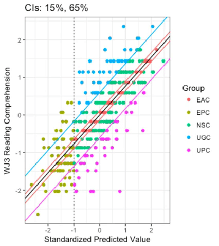

# Group Selection

One of the things we were most interested in when exploring this method is how changing around parameters of the regression changes the composition of the three main groups (EAC, UGC, UPC). We did three main things: change confidence interval, change reading comprehension measure, and change predictors.

In this repository, you'll find a core R script called [GroupSelection](./GroupSelection.R). Since each of the main explorations rely on the same type of script, I'm only uploading this main one. There are a few things we always do. 

**1) Create a decoding composite.**

We use four measures (word reading, nonword decoding, word fluency, and nonword fluency) to create a more stable deocding composite. You can see more about how this composite was created in the [create_composite](./create_composite.R) R script.

**2) Check predictors for normality.**

We make pretty good use of the `caret` package, specifically `preProcess`. After testing our predictors for normality using `dagoTest`, we often centered, scaled, and transformed them.

For more information and documentation on this function, check out [this](https://topepo.github.io/caret/pre-processing.html) page.

**3) Compare group differences.**

Once we ran the classifier regression model and assigned each subject to a group, we always checked the groups for differences on the measures included in the original regression (e.g., reading comprehension, age, nonverbal IQ, etc.). Ideally, the groups would be equal on all of the predictors and different on reading comprehension. This was not always the case.

**4) Check group sizes.**

We wanted mostly similar group sizes, so we checked the group sizes for each model.

**5) Removed subjects with a standardized predicted reading comprehension of -1 or less.**

Our study is primarily focused on people who have a discrepancy between their reading comprehension ability and their word reading ability. Individuals with a standardized predicted reading score of -1 have low scores on the predictors (likely word reading) as well as reading comprehension. This is definitely an interesting group (see literature on dyslexia and reading disorder!), but not relevant for our current investigation. 

**6) Ran both linear models and robust linear models**

Because we wanted to make sure our data didn't violate any assumptions of regression, we used `lm` with transformed variables and `rlm` with raw values.

Now, onto the things we explored!

## Confidence Intervals

In this method, we usually use confidence intervals (CIs) to place individuals into groups. To be a UGC, their measured reading comprehension ability has to be above some CI around their predicted reading comprehension. Similarly, UPCs have a measured reading comprehension score below some CI around the predicted reading comprehension. Finally, EACs have a measured score within some CI around the predicted score.  The original papers that have been published using this method use different CIs. to select their groups. For UPCs and UGCs, the CIs vary from 65 to 80%. For EACs, they vary from 15 to 25%. However, these papers rarely provide a rationale for using these different CIs. 

One key part of my code was used to easily switch between CIs.

```
ci.to.use <- c(.15, .65)
ci.title <- "CIs: 15%, 65%"
```
The first number was the within-CI for the EACs, and the second was the outside-CI for the UPCs and UGCs.

 

This image shows what hapens when you change around the CIs. Depending on how much you change them, the group sizes change a lot. The CIs that we primarily looked at were 15-60, 15-65, 15-70, and 20-70, since they most closely matched the literature. 

We relied on the group difference analyses to help us pick the best CIs.


## Reading Comprehension Measures

Our lab collects a lot of individal difference measures. With this dataset, we had four different reading comprehension measures. Not all subjects had data for all of the measures, but we used imputation methods to deal with that (for more details on how we imputed, you'd have to ask Clint!). 

Our reading comprehension measures included the Kaufman Test of Educational Achievement (KTEA) Reading Comprehension subtest, the Woodcock-Johnson III (WJ3) Passage Comprehension subtest, the Nelson-Denny (ND) Comprehension subtest, and the Gates-MacGinitie (GM) Comprehension subtest. 

The change to the core code was just switching out the outcome variable.

```
m1 <- lm(wj3.rcomp.tf ~ age.c + decoding.comp + wasi.matr.tf + wasi.vocab.cs, data = lmwv.cc)
m2 <- lm(ktea.tf ~ age.c + decoding.comp + wasi.matr.tf + wasi.vocab.cs, data = lmwv.cc)
m3 <- lm(gm.tf ~ age.c + decoding.comp + wasi.matr.tf + wasi.vocab.cs, data = lmwv.cc)
m4 <- lm(nd.tf ~ age.c + decoding.comp + wasi.matr.tf + wasi.vocab.cs, data = lmwv.cc)
```

We pretty quickly settled on WJ3 and KTEA -- WJ3 because it had the most complete data and KTEA because it produced the most balanced groups. We also made a reading comprehension composite using WJ3 and KTEA. Interestingly, the groups we found using the different reading comprehension measures were often different, even though all of the measures were ostensibly tapping the same construct (reading comprehension). This is related to research by [Keenan and Meenan (2014)](http://journals.sagepub.com/doi/full/10.1177/0022219412439326) which found that using different reading comprehension tests to define poor comprehenders led to very different groups, with an average overlap of **only 43%**.

## Predictors

Across studies, the specific measures used to predict reading comprehension ability vary. Most include age, nonverbal IQ (matrix reasoning or block design) and decoding (word and/or nonword). However, some include vocabulary (expressive or receptive) or even word fluency.

To explore these predictors, we ran a bunch of models. We had some with expressive vocabulary, some with receptive, and some with a composite of the two. We generally found that including vocabulary was necessary to keep the groups equal on things like decoding and nonverbal IQ.

Again, the code here was a pretty simple change.

```
m1 <- lm(wj3.rcomp.tf ~ age.c + decoding.comp + wasi.matr.tf + wasi.vocab.cs, data = lmwv.cc)
m2 <- lm(wj3.rcomp.tf ~ age.c + decoding.comp + wasi.matr.tf + ppvt.cs, data = lmwv.cc)
```

We also ran some models that included oral comprehension. The rationale here was to go beyond the Simple View of Reading (reading comprehension = decoding + oral comprehension). If individuals showed a discrepancy between their actual reading comprehension ability and a predicted value that included both decoding and oral comprehension, this discrepancy must be due to something that is not accounted for by the Simple View. Including oral comprehension did sometimes lead to well-balanced groups (depending on the CIs). However, for theoretical reasons we decided to use vocabulary and not oral comprehension in future analyses. This model could still be further explored to understand what contributes to comprehension beyond decoding and oral comprehension, though!

