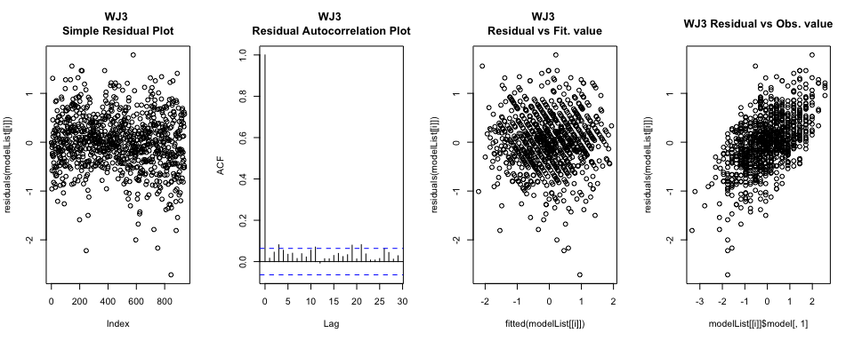
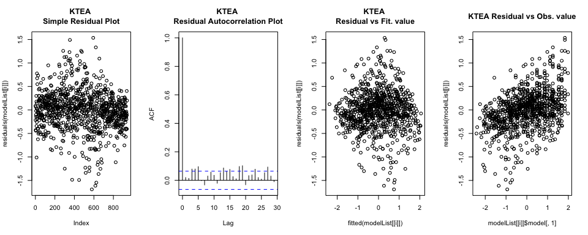

```r
# read in libraries, data
library(fBasics)
library(caret)
library(MASS)
library(ggplot2)
library(plyr)
library(reshape2)
library(xtable)
library(rlist)
library(xlsx)
library(dplyr)
library(missForest)
setwd("~/Dropbox/Definition_of_PCs/RegressionDefinitionMethod/Analyses_Nov2018")
data <- read.csv("FullData_Sept27_2018.csv")
```

# Data Imputation

First, we want to make our data as complete as possible. We use `missForest` because it appears to create the fewest errors in our data. See LINK HERE for more details.


```r
# select columns to impute
data_to_impute <- data %>%
  dplyr::select(SubjectID, Project,
         #age.mri, 
         age.beh, ppvt.raw, wasi.matr.raw, wj3.watt.raw,
         wj3.wid.raw, towre.w.ipm, towre.nw.ipm, 
         ktea2.raw, 
         #gm.rcomp.raw,
         #nd.rcomp.raw,
         wj3.rcomp.raw)

# remove WA score of 0 -- this is likely an error
data_to_impute$wj3.watt.raw[data_to_impute$wj3.watt.raw == 0] <- NA

# impute
missForest <- missForest(data_to_impute[,-c(1,2)], maxiter = 20)
```

```
##   missForest iteration 1 in progress...done!
##   missForest iteration 2 in progress...done!
##   missForest iteration 3 in progress...done!
##   missForest iteration 4 in progress...done!
##   missForest iteration 5 in progress...done!
##   missForest iteration 6 in progress...done!
```

```r
# save imputed data frame
imputed_data <- missForest$ximp
# add subject data
imputed_data <- cbind(data$SubjectID, imputed_data)
colnames(imputed_data)[1] <- "SubjectID"
```

# Decoding Composite

Now we will combine Word Attack and Letter-Word ID from WJ3 as well as TOWRE SWE and PDE to create a word decoding composite.


```r
# select composite data
comp <- dplyr::select(imputed_data, SubjectID, wj3.wid.raw, wj3.watt.raw, towre.w.ipm, towre.nw.ipm)
```

First we have to check whether the distributions of these variables are normal.


```r
for (i in 2:length(comp)){
  cat("\n-----------------\n",names(comp)[i],"\n")
  x <- dagoTest(comp[,i])
  omni <- x@test$p.value[1]
  skew <- x@test$p.value[2]
  cat("Omnibus p-val: ",omni,"\n\nSkewness p-val: ", skew, "\n")
}
```

```
## 
## -----------------
##  wj3.wid.raw 
## Omnibus p-val:  0 
## 
## Skewness p-val:  0 
## 
## -----------------
##  wj3.watt.raw 
## Omnibus p-val:  0 
## 
## Skewness p-val:  0 
## 
## -----------------
##  towre.w.ipm 
## Omnibus p-val:  1.554312e-15 
## 
## Skewness p-val:  0.001391216 
## 
## -----------------
##  towre.nw.ipm 
## Omnibus p-val:  2.534306e-12 
## 
## Skewness p-val:  2.399734e-08
```

They're all significantly non-normal, so we will center, scale, and transform them.


```r
# prepare to center, scale, and transform predictor variables
vars_tf <- names(comp[-1])
pp_md_tf <- preProcess(comp[,vars_tf], method = c("center", "scale", "YeoJohnson"), na.remove=T)

# check the lambda values associated with the predictors
for (name in vars_tf){
  lambda <- eval(substitute(pp_md_tf$yj$x$lambda, list(x = as.name(name))))
  cat(name, ": ", lambda, "\n")
}
```

```
## wj3.wid.raw :  4.089205 
## wj3.watt.raw :  4.618955 
## towre.w.ipm :  1.336691 
## towre.nw.ipm :  1.386909
```

```r
#execute centering, scaling, tranforming, etc.
tf_data <- predict(pp_md_tf, comp[,vars_tf])
```

Now that we have our transformed data, we can re-check its normality.


```r
#re-check distribution
for (i in 1:length(tf_data)){
  cat("\n-----------------\n",names(tf_data)[i],"\n")
  x <- dagoTest(tf_data[,i])
  omni <- x@test$p.value[1]
  skew <- x@test$p.value[2]
  cat("Omnibus p-val: ",omni,"\n\nSkewness p-val: ", skew, "\n")
}
```

```
## 
## -----------------
##  wj3.wid.raw 
## Omnibus p-val:  2.680078e-13 
## 
## Skewness p-val:  0.3002831 
## 
## -----------------
##  wj3.watt.raw 
## Omnibus p-val:  0 
## 
## Skewness p-val:  2.966703e-05 
## 
## -----------------
##  towre.w.ipm 
## Omnibus p-val:  7.443991e-08 
## 
## Skewness p-val:  0.1307562 
## 
## -----------------
##  towre.nw.ipm 
## Omnibus p-val:  0.0004123379 
## 
## Skewness p-val:  0.7379261
```

Overall, the skewness has become more normal for all of our measures. Now we will combine the four measures into a single composite decoding score.


```r
#create composite
tf_data$decode_composite <- rowMeans(scale(tf_data[,vars_tf]))

#put composite into data frame
imputed_data$decode_composite <- tf_data$decode_composite

#scale (but don't center!) composite
imputed_data$decode_composite <- scale(imputed_data$decode_composite, center = FALSE)[,1]
```

# Running Models

Now that our composite is created, we are ready to start running our models (almost). First, we need to check our predictors to see if they are normally distributed as well.


```r
normality_test <- c("wasi.matr.raw", "ppvt.raw", "decode_composite", "wj3.rcomp.raw", "ktea2.raw")
to_transform <- vector(mode = "character")
for (measure in normality_test){
  cat("\n-----------------\n",measure,"\n")
  x <- eval(substitute(dagoTest(imputed_data$i), list(i=measure)))
  omni <- x@test$p.value[1]
  skew <- x@test$p.value[2]
  cat("Omnibus p-val: ",omni,"\n\nSkewness p-val: ", skew, "\n")
  if (omni < .05 | skew < 0.5){
    to_transform <- append(to_transform, measure)
  }
}
```

```
## 
## -----------------
##  wasi.matr.raw 
## Omnibus p-val:  0 
## 
## Skewness p-val:  0 
## 
## -----------------
##  ppvt.raw 
## Omnibus p-val:  0 
## 
## Skewness p-val:  0 
## 
## -----------------
##  decode_composite 
## Omnibus p-val:  0.007553933 
## 
## Skewness p-val:  0.004143904 
## 
## -----------------
##  wj3.rcomp.raw 
## Omnibus p-val:  0.0002594362 
## 
## Skewness p-val:  5.91253e-05 
## 
## -----------------
##  ktea2.raw 
## Omnibus p-val:  0 
## 
## Skewness p-val:  0
```

All of our predictors (including the decoding composite) need to be transformed.


```r
pp_md_tf <- preProcess(imputed_data[,to_transform], method = c("center", "scale", "YeoJohnson"), na.remove=T)

#check the lambda values associated with the measures to be transformed
for (name in to_transform){
  lambda <- eval(substitute(pp_md_tf$yj$x$lambda, list(x = as.name(name))))
  cat(name, " : ", lambda, "\n")
}
```

```
## wasi.matr.raw  :  2.195247 
## ppvt.raw  :  4.995566 
## decode_composite  :  1.138884 
## wj3.rcomp.raw  :  1.938511 
## ktea2.raw  :  3.179944
```

```r
# transform data
tf_data <- predict(pp_md_tf, imputed_data[,to_transform])
# rename columns to include .tf instead of .raw
names(tf_data) <- data.frame(sapply(names(tf_data), gsub, pattern = "raw", replacement = "tf"))[,1]

normality_test2 <- names(tf_data)
for (measure in normality_test2){
  cat("\n-----------------\n",measure,"\n")
  x <- eval(substitute(dagoTest(tf_data$i), list(i=measure)))
  omni <- x@test$p.value[1]
  skew <- x@test$p.value[2]
  cat("Omnibus p-val: ",omni,"\n\nSkewness p-val: ", skew, "\n")
}
```

```
## 
## -----------------
##  wasi.matr.tf 
## Omnibus p-val:  0.01381228 
## 
## Skewness p-val:  0.3136766 
## 
## -----------------
##  ppvt.tf 
## Omnibus p-val:  1.314149e-06 
## 
## Skewness p-val:  0.1373592 
## 
## -----------------
##  decode_composite 
## Omnibus p-val:  0.2502685 
## 
## Skewness p-val:  0.9790962 
## 
## -----------------
##  wj3.rcomp.tf 
## Omnibus p-val:  0.07607548 
## 
## Skewness p-val:  0.7969338 
## 
## -----------------
##  ktea2.tf 
## Omnibus p-val:  1.110223e-16 
## 
## Skewness p-val:  0.04250339
```

The skewness is not longer significant for any of the predictors. That means we are almost ready to run our models! Let's center age.


```r
imputed_data$age.c <- imputed_data$age.beh - mean(imputed_data$age.beh, na.rm = TRUE)
```

Now we will create a dataframe for the models.


```r
model_dat <- cbind(imputed_data$SubjectID, imputed_data$age.c, tf_data)
colnames(model_dat)[1] <- "SubjectID"
colnames(model_dat)[2] <- "age.c"
```

And we run the models.


```r
comp.vars <- c("wj3.rcomp.tf", "ktea2.tf")
modelList <- list()
for (i in 1:length(comp.vars)){
  model <- eval(substitute(lm(x ~ age.c + decode_composite + wasi.matr.tf + ppvt.tf, data = model_dat), list(x = as.name(comp.vars[i]))))
  modelList[[i]] <- model
}
names(modelList) <- c("WJ3", "KTEA")
```

Now we can look at plots to see if our models violated any assmuptions.


```r
for (i in 1:length(modelList)){
  par(mfrow=c(1,4))
   plot(residuals(modelList[[i]]))
  title(paste(names(modelList)[i], "\nSimple Residual Plot"))
  acf(residuals(modelList[[i]]), main = "")
  title(paste(names(modelList)[i], "\nResidual Autocorrelation Plot"))
  plot(fitted(modelList[[i]]), residuals(modelList[[i]]))
  title(paste(names(modelList)[i], "\nResidual vs Fit. value"))
  plot(modelList[[i]]$model[,1], residuals(modelList[[i]]) )
  title(paste(names(modelList)[i], "Residual vs Obs. value"))
}
```

<!-- --><!-- -->

The plots look mostly fine.

# Creating Groups

First we need to get our predicted reading comprehension values and standardize them.


```r
resultsList <- list()
for (i in 1:length(modelList)){
  pred <- unlist(predict(modelList[i]))
  std.pred <- scale(pred)
  resid <- modelList[[i]]$residuals
  df <- data.frame(pred,std.pred,resid)
  resultsList[[i]] <- df
  rownames(resultsList[[i]]) <- 1:nrow(resultsList[[i]])
}
names(resultsList) <- c("WJ3", "KTEA")
list2env(resultsList,envir=.GlobalEnv)
```

```
## <environment: R_GlobalEnv>
```

Now we will pick the types of groups we want and the CIs we'd like to look at. 

* UPC: unexpected poor comprehender
* NSC: non-selected
* EAC: expected average comprehender
* UGC: unexpected good comprehender


```r
ci_names <- c("10_70", "15_65", "15_60", "15_70", "20_65", "20_70")
ci2z <- function(ci){qnorm(ci + (1 - ci)/2)}
grouping <- c("UPC", "NSC", "EAC", "NSC", "UGC")
## change here if you want to add more or different CIs
ciList <- list(c(.10, .70), c(.15,.65), c(.15,.60), c(.15,.70), c(.20,.65), c(.20,.70))
allList <- list()
for (i in 1:length(ciList)){
  ci.to.use <- ciList[[i]]
  groupsList <- list()
  for (model in names(resultsList)){
    my.bin <- eval(substitute(c(range(scale(i$resid))+.1, ci2z(ci.to.use), -ci2z(ci.to.use)), list(i = as.name(model))))
    my.bin <- sort(my.bin)
    groups <- eval(substitute(grouping[findInterval(scale(WJ3$resid), vec=my.bin, all.inside=T)],list(i = as.name(model))))
    x <- as.data.frame(groups)
    y <- cbind(imputed_data$SubjectID, x)
    groupsList[[model]] <- cbind(eval(as.name(model)), y)
    colnames(groupsList[[model]])[4] <- c("SubjectID")
    groupsList[[model]]$groups <- as.character(groupsList[[model]]$groups)
    groupsList[[model]]$groups[groupsList[[model]]$std.pred < -1] <- "EPC"
  }
  allList[[i]] <- groupsList
}
names(allList) <- ci_names
```

# Merge  Groups with MRI IDs

Now that we have our groups, we need to merge those groups with MRI IDs to see how many structural scans we have in each group.


```r
extra_info <- data %>%
  dplyr::select(SubjectID, handedness, gender, StructuralMRI.ID)

newList <- list()
tableList <- list()
for (i in 1:length(ciList)){
  mList <- list()
  tList <- list()
  for (model in names(resultsList)){
    rel_subs <- eval(substitute(subset(allList[[i]]$x, groups != "EPC"), list(x = as.name(model))))
    rel_subs <- subset(rel_subs, groups != "NSC")
    rel_subs$groups <- factor(rel_subs$groups)
    mri_subs <- merge(rel_subs, extra_info, by = "SubjectID", all = TRUE)
    mri_beh <- merge(mri_subs, imputed_data, by = "SubjectID", all = TRUE)
    all <- mri_beh[complete.cases(mri_beh$StructuralMRI.ID),]
    all2 <- all[complete.cases(all$groups),]
    all3 <- all2[all2$handedness == "right",]
    all3 <- all3[complete.cases(all3$handedness),]
    mList[[model]] <- all3
    table <- table(all3$groups)
    tList[[model]] <- table
  }
  newList[[i]] <- mList
  tableList[[i]] <- tList
}
names(newList) <- ci_names
names(tableList) <- ci_names
```

Now, we'll make a list showing how many scans there are in each group.


```r
pList <- list()
for (i in 1:length(tableList)){
  table.results <- data.frame(do.call("rbind", tableList[[i]]))
  RC_Measure <- rownames(table.results)
  table.results <- cbind(RC_Measure, table.results)
  pList[[i]] <- table.results
}
names(pList) <- ci_names

table.results <- data.frame(do.call("rbind", pList))
CIs <- substring(rownames(table.results),1,5)
table.results <- cbind(CIs, table.results)
tables <- table.results
```

# Group Differences

Finally, we will compare the groups on our relevant measures.


```r
gdifm <- vector(mode = "character")
ps <- vector(mode = "numeric")
group.diffs <- list("age.beh", "wj3.rcomp.raw", "ktea2.raw", "wasi.matr.raw", "ppvt.raw", "decode_composite")
group.diffs.list <- list()
for (i in 1:length(ciList)){
  gdList <- list()
  for (model in names(resultsList)){
    ares <- vector()
    for (j in group.diffs){
      form <- substitute(j ~ groups, list(j = as.name(j)))
      form <- as.formula(form)
      a1 <- eval(substitute(aov(form, data = newList[[i]]$x), list(x = as.name(model))))
      p.val <- summary(a1)[[1]][[1,"Pr(>F)"]]
      row <- list(j, p.val)
      ares <- rbind(ares,row)
      }
  ares <- as.data.frame(ares)
  ares$RC_measure <- model
  colnames(ares)[1] <- "GroupDiff_measure"
  colnames(ares)[2] <- "p"
  ares$p<- as.numeric(as.character(ares$p))
  ares$Sig[ares$p < .05] <- "*"
  gdList[[model]] <- ares
  }
  group.diffs.list[[i]] <- gdList
}
names(group.diffs.list) <- ci_names

gdList <- list()
for (i in 1:length(group.diffs.list)){
  table.results <- data.frame(do.call("rbind", group.diffs.list[[i]]))
  RC_Measure <- gsub("\\..*$", "", rownames(table.results))
  gdList[[i]] <- table.results
}
names(gdList) <- ci_names


g.diffs <- data.frame(do.call("rbind", gdList))
CIs <- substring(rownames(g.diffs),1,5)
g.diffs<- cbind(CIs, g.diffs)

g.diffs <- as.data.frame(g.diffs)
g.diffs <- g.diffs[,c(1,4,2,3,5)]
```

# Create Summary File


```r
write.xlsx(tables, file="summary.xlsx", sheetName="GroupSizes", row.names=FALSE, showNA = FALSE)
write.xlsx(subset(g.diffs, GroupDiff_measure == "age.beh"), file="summary.xlsx", sheetName="Age", append=TRUE, row.names=FALSE, showNA = FALSE)
write.xlsx(subset(g.diffs, GroupDiff_measure == "wj3.rcomp.raw"), file="summary.xlsx", sheetName="WJ3", append=TRUE, row.names=FALSE, showNA = FALSE)
write.xlsx(subset(g.diffs, GroupDiff_measure == "ktea2.raw"), file="summary.xlsx", sheetName="KTEA", append=TRUE, row.names=FALSE, showNA = FALSE)
write.xlsx(subset(g.diffs, GroupDiff_measure == "wasi.matr.raw"), file="summary.xlsx", sheetName="Matrix Reasoning", append=TRUE, row.names=FALSE, showNA = FALSE)
write.xlsx(subset(g.diffs, GroupDiff_measure == "ppvt.raw"), file="summary.xlsx", sheetName="PPVT", append=TRUE, row.names=FALSE, showNA = FALSE)
write.xlsx(subset(g.diffs, GroupDiff_measure == "decode_composite"), file="summary.xlsx", sheetName="Decoding Composite", append=TRUE, row.names=FALSE, showNA = FALSE)
```
