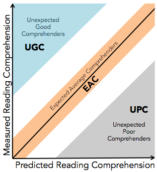

# Definition of Poor Comprehenders

This is a repository for a project I've been working on for about two years now (as of Spring 2018). The goal was to test a new way of defining a special population: **poor comprehenders**. 

**Poor comprehenders** are individuals who can read words out loud but don't really seem to understand what they are reading. Ways to define this population vary, but a lot of the time researchers just pick a few cutoffs based on standardized assessments (e.g, word reading above 100, reading comprehension below 90). At the end of the day, however, these cutoffs are somewhat arbitrary.

To address this issue, a [few](http://psycnet.apa.org/doiLanding?doi=10.1037%2Fa0023495) [relatively](https://www.ncbi.nlm.nih.gov/pubmed/24306458) [recent](http://www.tandfonline.com/doi/abs/10.1080/10888438.2013.775130) [papers](http://onlinelibrary.wiley.com/doi/10.1111/1467-9817.12108/abstract;jsessionid=044A34EA37801AD042C0CF7B96E1CC20.f04t04) began using a regression-based method, where reading comprehension ability was predicted from lower-level skills such as nonverbal IQ, word reading, and vocabulary. Then this predicted value was compared to an individual's measured reading comprehension score in order to classify their reading profile.

 Here you can see a graph showing the three classifications. Unexpected Good Comprehenders (UGCs) have a measured reading comprehension score that is higher than their predicted reading comprehension score. For Expected Average Comprehenders (EACs), the two scores are similar. Finally, Unexpected Poor Comprehenders (UPCs) have measured reading comprehension scores that are lower than expected.

However, the papers linked above don't usually explain their choice of low-level skills (decoding vs. word reading, expressive vs. receptive vocabulary, etc.) or how they chose the confidence intervals used to select UGC, EAC, and UPC participants. At [Haskins](http://haskinslabs.org/), across grants we have collected a lot of behavioral data on a lot of subjects. So we decided to take advantage of this rich dataset to explore this regression method and what it might tell us about comprehension.

In the two years, we have explored a lot of different things about reading comprehension and this method. As such, this repository will have some different sections. These are listed below.