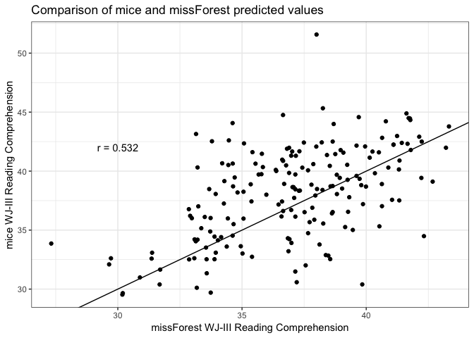

In this document, I compare the use of the `missForest` and `mice` packages to impute some data for the definition of poor comprehenders project.

### Background

We are using the findings from [Eckert et al. (2018)](https://www.frontiersin.org/articles/10.3389/fpsyg.2018.00644/full) to inform our imputation methods. They found the most success with the [`missForest` package](https://cran.r-project.org/web/packages/missForest/index.html) (as compared to mean replacement and predictive mean matching using the [`mice` package](https://cran.r-project.org/web/packages/mice/index.html)). 

In this paper they do **explicit multiple imputation**, where 10 imputed datasets are generated and then pooled to for point and variance estimates. However, personal communication with the creator of `missForest`, [Daniel Stekhoven](https://www.sib.swiss/stekhoven-daniel), suggests that this method is not necessary. In his words:

> [...] randomForest provides an implicit multiple imputation by averaging over many decision/regression trees [...] When we use the different imputation methods, missForest was so much better (while at the same time underestimating the standard deviation of the CIs) that my intermediate hypothesis is; we do not need multiple imputation if we have the right data (when the data is right, I have not yet figured out).

So, it seems like we can just use `missForest` without having to worry about multiple imputation. To check this, we compare explicit multiple imputation (using `mice`) to `missForest`.


```r
# read in libraries, data
library(missForest)
library(mice)
library(fBasics)
library(dplyr)
library(ggplot2)
library(gridExtra)
library(micemd)
setwd("~/definitionofPCs")
# this has all the raw data, no overlapping subjects
data <- read.csv("FullData_Sept27_2018.csv")
```


```r
# look at missingness
data %>% summarize_all(funs(sum(is.na(.)) / length(.)))
```

```
##   SubjectID Project   age.mri     age.beh    gender sspan.raw  ppvt.raw
## 1         0       0 0.6606383 0.005319149 0.1638298 0.2553191 0.1585106
##   wasi.vocab.raw wasi.matr.raw   wasi.iq wj3.watt.raw wj3.wid.raw
## 1      0.2297872    0.09574468 0.2297872   0.08617021  0.08617021
##   wj3.oralcomp.raw celf.rs.raw celf.fs.raw towre.w.ipm towre.nw.ipm
## 1        0.2489362   0.5276596   0.5255319  0.07234043   0.07234043
##   wj3.rf.ipm handedness StructuralMRI.ID ktea2.raw gm.rcomp.raw
## 1  0.4212766  0.7202128        0.6638298 0.5531915    0.5882979
##   nd.rcomp.raw wj3.rcomp.raw
## 1    0.8148936     0.1968085
```

```r
# subset to just predictors and WJ3
## not using KTEA or GM or ND for now
dat_imp <- data %>%
  select(SubjectID, Project,
         #age.mri, 
         age.beh, ppvt.raw, wasi.matr.raw, wj3.watt.raw,
         wj3.wid.raw, towre.w.ipm, towre.nw.ipm, 
         #ktea2.raw, 
         #gm.rcomp.raw,
         #nd.rcomp.raw,
         wj3.rcomp.raw)
```


### Comparing `mice` to `missForest`

#### Full dataset

First, we will use mice and missForest to impute the missing values we have and see how similar the values they create are.


```r
## impute all missing values for all variables
# missForest -- max iterations of 20
missForest <- missForest(dat_imp[,-c(1,2)], maxiter = 20)
```

```
##   missForest iteration 1 in progress...done!
##   missForest iteration 2 in progress...done!
##   missForest iteration 3 in progress...done!
##   missForest iteration 4 in progress...done!
##   missForest iteration 5 in progress...done!
##   missForest iteration 6 in progress...done!
##   missForest iteration 7 in progress...done!
##   missForest iteration 8 in progress...done!
##   missForest iteration 9 in progress...done!
```

```r
# mice -- 10 imputations, predictive mean matching method, don't print all output, 20 max iterations
ind.clust <- 1
temp <- mice(dat_imp[,-1],m=1,maxit=0)
temp$pred[ind.clust,ind.clust] <-0
temp$pred[-ind.clust,ind.clust] <- -2
temp$pred[temp$pred==1] <- 2
predictor.matrix <- temp$pred
mice <- mice(dat_imp[,-1], m = 5, maxit = 5, predictorMatrix = predictor.matrix, method = "2l.2stage.norm", print = FALSE)
# create mice dataset
mice_complete <- complete(mice)

# create dataset to compare predictions from missForest and mice
compare <- data.frame(data$SubjectID)
compare$MF_wj3.rcomp.raw <- missForest$ximp$wj3.rcomp.raw
compare$M_wj3.rcomp.raw <- mice_complete$wj3.rcomp.raw
compare$real <- dat_imp$wj3.rcomp.raw
# select only rows that had missing data in original dataset
compare_missings <- compare[!complete.cases(compare$real),]

# test correlation
cor_test <- cor.test(compare_missings$MF_wj3.rcomp.raw, compare_missings$M_wj3.rcomp.raw)
ggplot(compare_missings, aes(MF_wj3.rcomp.raw, M_wj3.rcomp.raw)) + 
  geom_point() + theme_bw() +
  labs(title = "Comparison of mice and missForest predicted values",
       x = "missForest WJ-III Reading Comprehension",
       y = "mice WJ-III Reading Comprehension") + geom_abline() + 
  annotate("text", x = 30, y = 42, label = paste0("r = ", round(cor_test$estimate, 3)))
```

<!-- -->

The predictions from `missForest` and `mice` for `wj3.rcomp.raw` are significantly correlated, but not to an extreme extent. This suggests that the two methods are in fact producing different results. Let's try using data where we know the actual `wj3.rcomp.raw` to see how close the methods get.

#### Half of dataset removed


```r
# make complete-cases dataset
cc_dat <- dat_imp[complete.cases(dat_imp),]
# randomly select half of the rows
randsample <- sample_frac(cc_dat, size = .5)
# set wj3.rcomp.raw in those rows to NA
cc_dat$wj3.rcomp.raw[cc_dat$SubjectID %in% randsample$SubjectID] <- NA

# sanity check -- is half of rcomp missing?
cc_dat %>% summarize_all(funs(sum(is.na(.)) / length(.)))
```

```
##   SubjectID Project age.beh ppvt.raw wasi.matr.raw wj3.watt.raw
## 1         0       0       0        0             0            0
##   wj3.wid.raw towre.w.ipm towre.nw.ipm wj3.rcomp.raw
## 1           0           0            0     0.5007112
```

```r
## impute wj3.rcomp.raw
# xtrue provides actual dataset, 20 max iterations
missForest_imputeTest <- missForest(cc_dat[,-c(1,2)], xtrue = dat_imp[,-c(1,2)], maxiter = 20)
```

```
##   missForest iteration 1 in progress...done!
##   missForest iteration 2 in progress...done!
##   missForest iteration 3 in progress...done!
```

```r
# mice -- 10 imputations, predictive mean matching method, don't print all output, 20 max iterations
mice_imputeTest <- mice(cc_dat[,-c(1)],  m = 20, maxit = 20, predictorMatrix = predictor.matrix, method = "2l.2stage.norm", printFlag = FALSE) 
# create mice dataset
mice_imputeTest_data <- complete(mice_imputeTest)

# create dataframe to compare the two methods
compare_test <- data.frame(cc_dat$SubjectID, 
                           missForest_imputeTest$ximp$wj3.rcomp.raw, 
                           mice_imputeTest_data$wj3.rcomp.raw)
names(compare_test) <- c("SubjectID", "missForest_wj3.rcomp.raw", "mice_wj3.rcomp.raw")
compare_test <- merge(compare_test, dat_imp[,c(1,10)], by = "SubjectID")
compare_test$missForest_error <- compare_test$missForest_wj3.rcomp.raw - compare_test$wj3.rcomp.raw
compare_test$mice_error <- compare_test$mice_wj3.rcomp.raw - compare_test$wj3.rcomp.raw

min(compare_test$mice_error)
```

```
## [1] -21.389
```

```r
# sum the total error for each method
paste("missForest total error:", round(sum(abs(compare_test$missForest_error)), 4))
```

```
## [1] "missForest total error: 748.1465"
```

```r
paste("mice total error:", round(sum(abs(compare_test$mice_error)), 4))
```

```
## [1] "mice total error: 1018.8113"
```

These data suggest that for our dataset, `missForest` is the best option, even without explicit multiple imputation.


